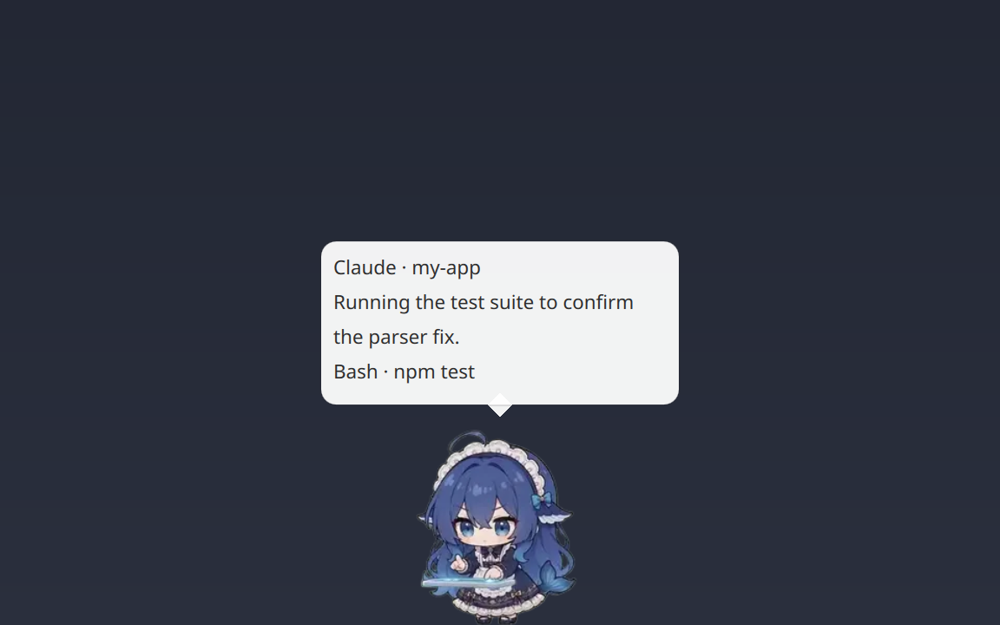

# Agent Pet for Omarchy

English | [简体中文](README.zh-CN.md)



Agent Pet is an Omarchy shell plugin (`chthollyphile.agent-pet`) that puts a desktop pet on screen and lets it react to what Claude Code and Codex are doing. When an agent thinks, calls a tool, waits for approval, finishes, or fails, the pet switches to a matching animation and shows the current progress in a speech bubble.

This repository is the Omarchy release of [agent-pet](https://github.com/chthollyphile/agent-pet) and contains only the files the plugin needs at runtime. It is generated from the main repository; please open issues and pull requests there. The main repository also covers standalone mode (any Wayland desktop with layer-shell), the full configuration reference, and building from source.

The character, animations, and core pet behavior are ported from [dsh-pet](https://github.com/PC2005-cloud/dsh-pet). See [Credits and license](#credits-and-license).

## Features

- **Pet behavior**: idling, random actions, turning, walking, click reactions, and physics-based dragging and throwing.
- **Work status**: six states (thinking, working, reviewing results, waiting, success, error) driven by Claude Code / Codex hooks. The bubble can show the project name, the current tool and command, and the agent's own step narration.
- **Attention alerts**: a bubble when approval is needed, when a task completes, or when it fails, plus a desktop notification (agent name and status only) if the terminal that sent the event is not focused.
- **Usage**: shows each rate-limit window's usage and reset countdown from Omarchy's `omarchy.agents` data.
- **Murmurs and chat**: generated with `claude -p` or `codex exec`, only when you ask for them.
- **English and Chinese UI**, chosen from the system locale.

## Requirements

- Omarchy 4
- The `qt6-imageformats` package, which provides WebP decoding for Qt. Restart the shell with `omarchy-restart-shell` after installing it.
- `jq` and `notify-send` (both present on a default Omarchy install)
- Claude Code and/or the Codex CLI for work-status integration

## Installation

```bash
omarchy plugin add https://github.com/chthollyphile/omarchy-agent-pet --enable
```

The repository includes the animation assets, so the clone is about 180 MB and the pet appears as soon as the plugin is enabled.

### Connect Claude Code and Codex (optional)

Work status needs hooks in the agents' configuration. This step edits `~/.claude/settings.json` and `~/.codex/hooks.json`; each file is backed up first as `<file>.bak-agent-pet-<timestamp>`, and running it again does not create duplicate entries.

```bash
~/.config/omarchy/plugins/chthollyphile.agent-pet/bin/agent-pet-install-hooks
```

Codex may ask you to review the new hooks the first time it sees them; trust them when prompted. The hook writes nothing to standard output and returns immediately, so agents are not slowed down.

## Usage

- Drag the pet to move it, or throw it. Left-click for a reaction; right-click for the menu (usage, murmur, chat, hide).
- Command-line control through the IPC target `agent-pet`:

```bash
omarchy-shell agent-pet state           # JSON: sessions, usage, configuration status
omarchy-shell agent-pet say "Hello"
omarchy-shell agent-pet usage
omarchy-shell agent-pet toggle          # hide / show
```

## Configuration

Built-in defaults live in `assets/config.json`. Put your settings in `~/.config/agent-pet/config.jsonc` (comments allowed); changes apply as soon as the file is saved. Each top-level field in your file replaces the default as a whole. See the [configuration reference](https://github.com/chthollyphile/agent-pet#configuration) for every field.

```jsonc
{
  "language": "auto",                                // auto, zh, or en
  "workStatusDetail": true,                          // show the tool and command, e.g. "Bash · npm test"
  "stepSummary": { "mode": "transcript", "intervalSec": 60 },
  "clickAction": "usage"                             // left-click shows usage
}
```

## Updating

```bash
omarchy plugin update chthollyphile.agent-pet
```

## Uninstallation

Remove the hooks first, because they point to a script inside the plugin directory:

```bash
~/.config/omarchy/plugins/chthollyphile.agent-pet/bin/agent-pet-install-hooks --uninstall
omarchy plugin remove chthollyphile.agent-pet
```

To remove your settings and local data as well:

```bash
rm -rf ~/.config/agent-pet ~/.local/state/agent-pet ~/.cache/agent-pet
```

The `.bak-agent-pet-*` backups next to `~/.claude/settings.json` and `~/.codex/hooks.json` are kept; delete them if you no longer need them.

## Privacy and permissions

The plugin runs unsandboxed inside the Omarchy shell with your user permissions.

- **Files written**: `~/.local/state/agent-pet/` and, only when you run the hook installer, `~/.claude/settings.json` and `~/.codex/hooks.json`. It never writes your `config.jsonc`.
- **Network access**: none by default. Usage data comes from Omarchy's own `omarchy.agents` collector; only `"usage": {"source": "builtin"}` makes the plugin query Claude / Codex rate limits itself.
- **Model calls** happen only for the **Murmur** and **Chat** menu actions, the `whisper` and `chat` IPC methods, and the opt-in `whisperAuto` and `stepSummary.mode = "model"` settings. They run your own `claude` or `codex` CLI.
- **Data forwarded by hooks** is limited to the event name, session ID, project path, tool name, the first line of the tool arguments (up to 120 characters), notification text (up to 200), the first 300 characters of the turn's prompt, the final reply when a turn ends (up to 2000), and the transcript path. It never leaves your machine.
- **Session transcripts** are read only when `stepSummary.mode = "transcript"`, and only the last 400 KB each time.
- **Process arguments carry no private content**, because other local users can read every process's command line. Hook events are passed through a private file in `$XDG_RUNTIME_DIR/agent-pet/` (directory mode 700, deleted right after the pet reads it), prompts and chat history reach `claude` / `codex` on standard input with the system prompt in a private file, and desktop notifications contain only the agent name and status. Text you pass yourself to `omarchy-shell agent-pet say` or `chat` is part of that command's line.
- **`~/.local/state/agent-pet/`** (chat history, prompt files) is kept at mode 700.

## Credits and license

**[dsh-pet](https://github.com/PC2005-cloud/dsh-pet)** (MIT, © PC2005-cloud): the character, the 106 animations, stickers, and icons under `assets/` (transcoded from dsh-pet), the default configuration, and the physics, animation, and movement logic bundled into `lib/shared.mjs`.

**[Omarchy](https://github.com/basecamp/omarchy)** (MIT, © David Heinemeier Hansson): `bin/agent-pet-usage` ports the rate-limit collection of the `omarchy.agents` plugin.

Agent Pet is released under the MIT License; see [LICENSE](LICENSE), which also carries the dsh-pet and Omarchy copyright notices.
