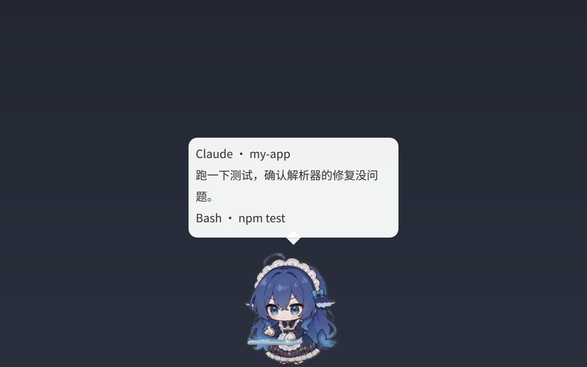

# Agent Pet for Omarchy

[English](README.md) | 简体中文



Agent Pet 是一个 Omarchy shell 插件（`chthollyphile.agent-pet`），在桌面上放一只会随 Claude Code 和 Codex 工作状态做出反应的宠物：agent 思考、调用工具、等待确认、完成或出错时，宠物会切换对应的动画，并在头顶的气泡里显示当前进度。

本仓库是 [agent-pet](https://github.com/chthollyphile/agent-pet) 的 Omarchy 发布版，只包含插件运行所需的文件，由主仓库自动生成；问题和 PR 请提交到主仓库。独立模式（任意支持 layer-shell 的 Wayland 桌面）、完整的配置说明和从源码构建也都在主仓库。

角色、动画和桌宠核心逻辑移植自 [dsh-pet](https://github.com/PC2005-cloud/dsh-pet)，详见[致谢与许可证](#致谢与许可证)。

## 功能

- **桌宠行为**：待机、随机动作、转向、行走、点击回应，以及带物理效果的拖拽与甩抛。
- **工作状态联动**：通过 Claude Code / Codex 的 hooks 接收事件，在思考、工作、整理、等待、成功、出错 6 种状态之间切换。气泡可显示项目名、当前工具与命令摘要，以及 agent 自己写的步骤说明。
- **等待提醒**：需要确认、任务完成或出错时显示气泡；发出事件的终端不在前台时，同时发送系统通知（只含 agent 名称和状态）。
- **用量显示**：使用 Omarchy `omarchy.agents` 的数据，列出每个额度窗口的用量和重置倒计时。
- **碎碎念与对话**：通过 `claude -p` 或 `codex exec` 生成，只在你主动触发时调用。
- **中英文界面**：根据系统语言自动选择。

## 运行要求

- Omarchy 4
- `qt6-imageformats` 软件包：Qt 的 WebP 解码插件。安装后运行 `omarchy-restart-shell` 重启 shell。
- `jq`、`notify-send`（Omarchy 默认已安装）
- 需要工作状态联动时：Claude Code 和/或 Codex CLI

## 安装

```bash
omarchy plugin add https://github.com/chthollyphile/omarchy-agent-pet --enable
```

仓库包含动画素材，clone 约 180 MB，启用插件后宠物会直接出现。

### 接入 Claude Code 和 Codex（可选）

工作状态联动需要在 agent 的配置里加入 hooks。这一步会修改 `~/.claude/settings.json` 和 `~/.codex/hooks.json`，修改前先备份为 `<文件>.bak-agent-pet-<时间戳>`；重复运行不会产生重复条目。

```bash
~/.config/omarchy/plugins/chthollyphile.agent-pet/bin/agent-pet-install-hooks
```

Codex 第一次看到新 hooks 时可能要求审核，选择信任即可。hook 不向标准输出写任何内容并立即返回，不会拖慢 agent。

## 使用

- 拖动宠物可移动或甩出；左键点击触发回应；右键打开菜单（查看用量、碎碎念、对话、隐藏等）。
- 通过 IPC 目标 `agent-pet` 在命令行控制：

```bash
omarchy-shell agent-pet state           # JSON：会话、用量、配置状态
omarchy-shell agent-pet say "你好"
omarchy-shell agent-pet usage
omarchy-shell agent-pet toggle          # 隐藏 / 显示
```

## 配置

内置默认值在 `assets/config.json`。个人设置写在 `~/.config/agent-pet/config.jsonc`（允许注释），保存后立即生效。文件里的每个顶层字段会整体替换默认值。全部字段见主仓库的[配置说明](https://github.com/chthollyphile/agent-pet/blob/main/README.zh-CN.md#配置)。

```jsonc
{
  "language": "auto",                                // auto、zh 或 en
  "workStatusDetail": true,                          // 显示工具和命令，例如 "Bash · npm test"
  "stepSummary": { "mode": "transcript", "intervalSec": 60 },
  "clickAction": "usage"                             // 左键查看用量
}
```

## 更新

```bash
omarchy plugin update chthollyphile.agent-pet
```

## 卸载

先移除 hooks，因为它们指向插件目录里的脚本：

```bash
~/.config/omarchy/plugins/chthollyphile.agent-pet/bin/agent-pet-install-hooks --uninstall
omarchy plugin remove chthollyphile.agent-pet
```

如需同时删除个人设置和本地数据：

```bash
rm -rf ~/.config/agent-pet ~/.local/state/agent-pet ~/.cache/agent-pet
```

`~/.claude/settings.json` 和 `~/.codex/hooks.json` 旁边的 `.bak-agent-pet-*` 备份会保留，不需要时可以手动删除。

## 隐私与权限

插件在 Omarchy shell 进程内以当前用户权限运行，没有沙箱。

- **写入的文件**：`~/.local/state/agent-pet/`，以及仅在你运行 hook 安装脚本时修改的 `~/.claude/settings.json` 和 `~/.codex/hooks.json`。不会写入你的 `config.jsonc`。
- **网络访问**：默认没有。用量数据来自 Omarchy 自带的 `omarchy.agents` 采集；只有设置 `"usage": {"source": "builtin"}` 时，插件才会自己查询 Claude / Codex 的额度。
- **模型调用**只发生在菜单的**碎碎念**、**对话**，IPC 的 `whisper`、`chat`，以及需要手动开启的 `whisperAuto` 和 `stepSummary.mode = "model"`。调用的是你本机的 `claude` 或 `codex` CLI。
- **hooks 转发的数据**仅限：事件名、会话 ID、项目路径、工具名、工具参数首行（最多 120 字符）、通知文本（最多 200 字符）、本轮提问前 300 字符、回合结束时的最终回复（最多 2000 字符）和 transcript 路径。数据不会离开本机。
- **会话 transcript** 只在 `stepSummary.mode = "transcript"` 时读取，每次只读最后 400 KB。
- **进程参数里不放私密内容**：本机其他用户能看到所有进程的命令行。hook 事件经 `$XDG_RUNTIME_DIR/agent-pet/` 下的私有文件传递（目录权限 700，宠物读完立即删除）；提示词和对话历史通过标准输入交给 `claude` / `codex`，系统提示词写在私有文件里；系统通知只包含 agent 名称和状态。你自己通过 `omarchy-shell agent-pet say` 或 `chat` 传入的文字会出现在该命令的命令行里。
- **`~/.local/state/agent-pet/`**（对话记录、提示词文件）权限保持为 700。

## 致谢与许可证

**[dsh-pet](https://github.com/PC2005-cloud/dsh-pet)**（MIT，© PC2005-cloud）：角色、`assets/` 下的 106 个动画、表情包和图标（由 dsh-pet 素材转码）、默认配置，以及打包进 `lib/shared.mjs` 的物理、动画选择和移动逻辑。

**[Omarchy](https://github.com/basecamp/omarchy)**（MIT，© David Heinemeier Hansson）：`bin/agent-pet-usage` 移植自 `omarchy.agents` 插件的额度采集。

Agent Pet 以 MIT 许可证发布，见 [LICENSE](LICENSE)，其中同时保留了 dsh-pet 和 Omarchy 的版权声明。
